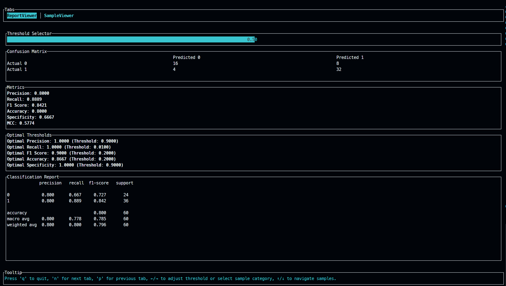
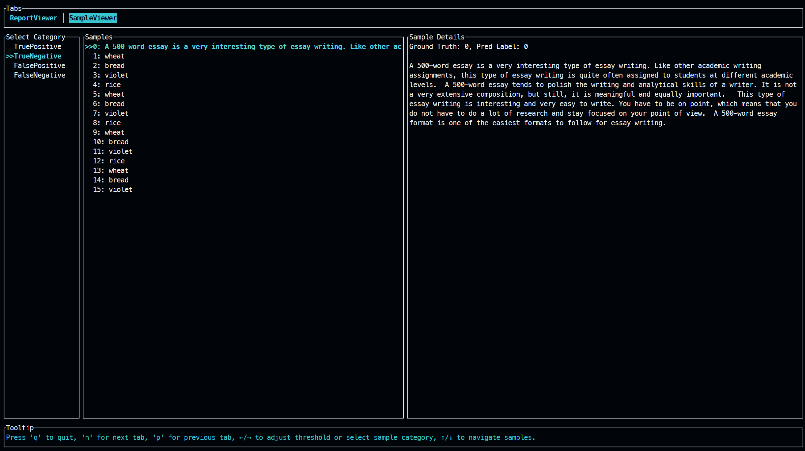

# MetricWhiz

- [MetricWhiz](#metricwhiz)
  - [Features](#features)
  - [Installation](#installation)
    - [From Source](#from-source)
    - [Download Pre-built Binaries](#download-pre-built-binaries)
  - [Usage](#usage)
  - [Key Bindings](#key-bindings)
  - [Tabs](#tabs)
  - [Error Handling](#error-handling)
  - [Author](#author)
  - [License](#license)

MetricWhiz is a command-line application designed to process prediction files and provide a comprehensive evaluation of binary classification models. The application offers an interactive terminal interface to visualize metrics, adjust thresholds, and explore classification results.




## Features

- **Command-Line Interface**: Easily specify the path to your prediction file.
- **Interactive Terminal Interface**: Navigate through different tabs to view reports and sample data.
- **Threshold Adjustment**: Dynamically adjust the classification threshold to see its impact on metrics.
- **Classification Metrics**: View precision, recall, F1 score, accuracy, specificity, MCC, and AUROC.
- **Confusion Matrix**: Visual representation of true positives, true negatives, false positives, and false negatives.
- **Sample Exploration**: Filter and examine samples by their classification category.

## Installation

### From Source

To use MetricWhiz, ensure you have Rust installed on your system. Then, clone the repository and build the application:

```bash
git clone <repository-url>
cd metricwhiz
cargo build --release
```

### Download Pre-built Binaries

Pre-built binaries for MetricWhiz are available for Windows, macOS, and Linux. You can download them from the [Releases](https://github.com/<your-username>/metricwhiz/releases) page on GitHub. Follow these steps:

1. Navigate to the [Releases](https://github.com/<your-username>/metricwhiz/releases) page.
2. Find the latest release.
3. Download the appropriate binary for your operating system:
   - `metricwhiz-windows.exe` for Windows
   - `metricwhiz-macos` for macOS
   - `metricwhiz-linux` for Linux
4. Make sure the binary is executable (on macOS and Linux, you may need to run `chmod +x <binary-name>`).

## Usage

To run MetricWhiz, use the following command:

```bash
./metricwhiz <path-to-prediction-file>
```

**Arguments:**

- `<path-to-prediction-file>`: The path to the CSV file containing predictions. The file must include `pred_score`, `ground_truth`, and `text` columns.

## Key Bindings

- **'q'**: Quit the application.
- **'n'**: Move to the next tab.
- **'p'**: Move to the previous tab.
- **Left/Right Arrow Keys**: Adjust the classification threshold in the Report Viewer tab or navigate categories in the Sample Viewer tab.
- **Up/Down Arrow Keys**: Navigate through samples in the Sample Viewer tab.

## Tabs

- **Report Viewer**: Displays classification metrics, confusion matrix, and optimal thresholds.
- **Sample Viewer**: Allows exploration of individual samples categorized as True Positive, True Negative, False Positive, or False Negative.

## Error Handling

If the specified prediction file does not exist, the application will terminate with an error message.

## Author

MetricWhiz is developed by Manpreet Singh.

## License

This project is licensed under the Apache License 2.0 - see the LICENSE file for details.